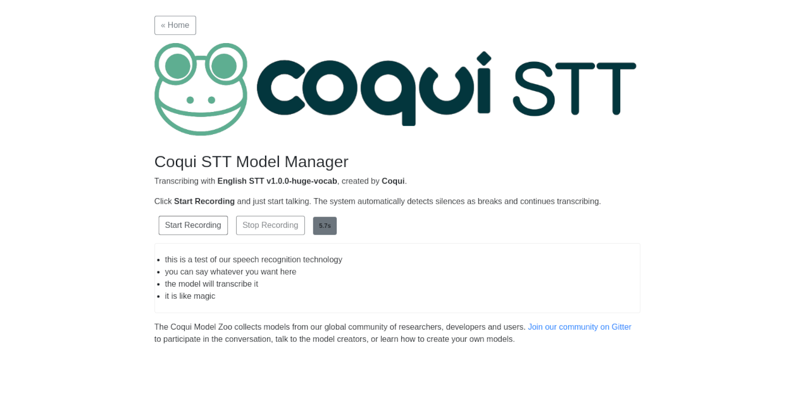

# Coqui STT Model manager


> **Note**
> 
> This project is no longer actively maintained, and we have stopped hosting the online Model Zoo. We've seen focus shift towards newer STT models such as [Whisper](https://github.com/openai/whisper), and have ourselves focused on [Coqui TTS](https://github.com/coqui-ai/TTS) and [Coqui Studio](https://coqui.ai/).
> 
> The models will remain available in [the releases of the coqui-ai/STT-models repo](https://github.com/coqui-ai/STT-models/releases).

🐸STT Model Manager is a tool for installing and trying out Coqui STT models from the [Coqui Model Zoo](https://coqui.ai/models/).

# Usage

Dependencies:

 - Python >= 3.7 (On Raspberry Pi, only Python 3.7 is supported)

```bash
$ pip install coqui_stt_model_manager
$ stt-model-manager
```

On Raspberry Pi:

```bash
$ pip install https://github.com/coqui-ai/STT/releases/download/v1.3.0/stt-1.3.0-cp37-cp37m-linux_armv7l.whl
$ pip install coqui_stt_model_manager
$ stt-model-manager
```



# Build and install from source

Build dependencies:

 - Node.JS
 - Yarn
 - Python >=3.7
 - Up-to-date pip/setuptools/wheel packages

```bash
$ # Create and activate virtualenv:
$ python -m venv /tmp/venv
$ /tmp/venv/bin/activate
$ # Update Python packaging tools:
$ python -m pip install -U pip setuptools wheel
$ # Install package
$ make install
```

# Development installation (editable, with pre-commit hooks)

See [`CONTRIBUTING`](./CONTRIBUTING.md).

# Running in development mode (watching file changes and rebuilding automatically)

The following command will watch the React-based front-end files for changes and rebuild automatically:

```bash
$ yarn watch
```

Then, in a separate terminal window run the following to start the Python server in debug mode:

```bash
$ # Create and activate virtualenv:
$ python -m venv /tmp/venv
$ /tmp/venv/bin/activate
$ # Start server in debug mode with automatic server reloads:
$ stt-model-manager --debug
```

For now you have to reload the browser manually. We'd gladly welcome a PR adding auto-refresh functionality :)

# Build Python package (sdist/wheel)

```bash
$ make package
$ ll dist/
$ pip install dist/*.whl
```
